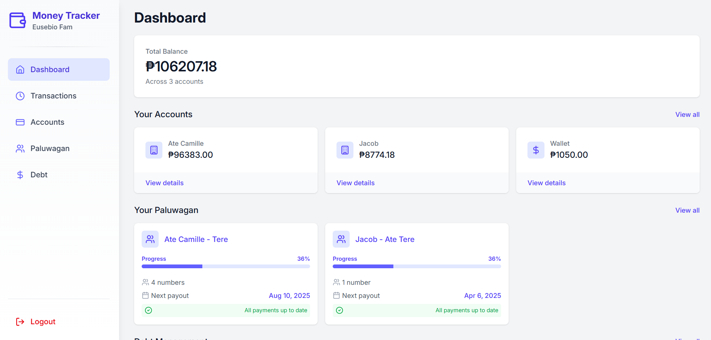

# Family Money Tracker

[](https://reactjs.org/)
[](https://firebase.google.com/)
[](https://tailwindcss.com/)
[](https://www.typescriptlang.org/)

A comprehensive financial tracking application designed for families to manage their finances in one place. Track accounts, monitor balances, manage debts, participate in community savings (paluwagan), and view transaction history with ease.



## ✨ Features

- **Account Management**: Track multiple financial accounts in one place
- **Balance Overview**: Get a clear view of your total balance across all accounts
- **Transaction History**: Log and categorize your income and expenses
- **Debt Tracking**: Manage your debts and payment schedules
- **Paluwagan System**: Participate in and track community savings programs
- **Multi-currency Support**: Handle different currencies for international families
- **Responsive Design**: Works seamlessly on desktop and mobile devices
- **User Authentication**: Secure login with email/password or Google authentication
- **Data Persistence**: All your financial data is securely stored in Firebase

## 🚀 Getting Started

### Prerequisites

- npm or yarn
- Firebase account

### Installation

1. Clone the repository
   ```bash
   git clone https://github.com/cob-byte/FamMoneyTracker.git
   cd family-money-tracker
   ```

2. Install dependencies
   ```bash
   npm install
   # or
   yarn install
   ```

3. Set up Firebase configuration
   - Create a `.env` file in the root directory
   - Add your Firebase configuration:
   ```
   VITE_FIREBASE_API_KEY=your-api-key
   VITE_FIREBASE_AUTH_DOMAIN=your-auth-domain
   VITE_FIREBASE_PROJECT_ID=your-project-id
   VITE_FIREBASE_STORAGE_BUCKET=your-storage-bucket
   VITE_FIREBASE_MESSAGING_SENDER_ID=your-messaging-sender-id
   VITE_FIREBASE_APP_ID=your-app-id
   VITE_FIREBASE_MEASUREMENT_ID=your-measurement-id
   ```

4. Start the development server
   ```bash
   npm run dev
   # or
   yarn dev
   ```

5. Open your browser and navigate to `http://localhost:5173`

## 🏗️ Project Structure

```
family-money-tracker/
├── public/             # Static assets
├── src/
│   ├── assets/         # Project Assets
│   ├── firebase/       # Firebase config
│   ├── components/     # Reusable UI components
│   ├── contexts/       # React context providers
│   ├── pages/          # Application pages
│   ├── types/          # TypeScript type definitions
│   ├── App.tsx         # Main application component
│   ├── main.tsx        # Application entry point
│   └── vite-env.d.ts   # Vite environment types
├── eslint.config.js    # ESLint configuration
├── index.html          # HTML entry point
├── package.json        # Project dependencies
├── tailwind.config.js  # Tailwind CSS configuration
├── tsconfig.app.json   # TypeScript configuration
└── vite.config.ts      # Vite configuration
```

## 💻 Tech Stack

- **Frontend**: React 19, React Router 7
- **Styling**: TailwindCSS 4
- **Icons**: Lucide React
- **Backend & Authentication**: Firebase 11
- **Language**: TypeScript 5
- **Build Tool**: Vite 6
- **Notifications**: React Toastify

## 📱 Features Breakdown

### Account Management
- Create and manage multiple accounts (checking, savings, investments)
- Track balance for each account
- Visualize account distribution

### Transaction Tracking
- Log income and expenses
- Categorize transactions
- View transaction history
- Filter and search transactions

### Debt Management
- Track loans and debts
- Set payment schedules
- Monitor interest and principal payments
- View debt payoff timeline

### Paluwagan System
- Create or join community savings groups
- Track contribution schedules
- Monitor total pool amount
- Schedule payouts

### User Management
- User authentication
- Profile management
- Currency preferences
- Account setup wizard

## 🛡️ Security

- Secure authentication via Firebase Auth
- Data stored in Cloud Firestore with security rules
- Password recovery functionality
- Protected routes for authenticated users

## 🔮 Future Enhancements

- Budget planning and tracking
- Financial reports and insights
- Bill reminders and scheduling
- Mobile application (React Native)
- Data export functionality
- Dark mode support
- Multi-language support

## 🤝 Contributing

Contributions are welcome! Please feel free to submit a Pull Request.

1. Fork the repository
2. Create your feature branch (`git checkout -b feature/amazing-feature`)
3. Commit your changes (`git commit -m 'Add some amazing feature'`)
4. Push to the branch (`git push origin feature/amazing-feature`)
5. Open a Pull Request

## 🙏 Acknowledgments

- [React](https://reactjs.org/)
- [Firebase](https://firebase.google.com/)
- [TailwindCSS](https://tailwindcss.com/)
- [Lucide Icons](https://lucide.dev/)
- [React Router](https://reactrouter.com/)
- [TypeScript](https://www.typescriptlang.org/)
- [Vite](https://vitejs.dev/)

---

Developed with ❤️ for families who want to take control of their finances together.